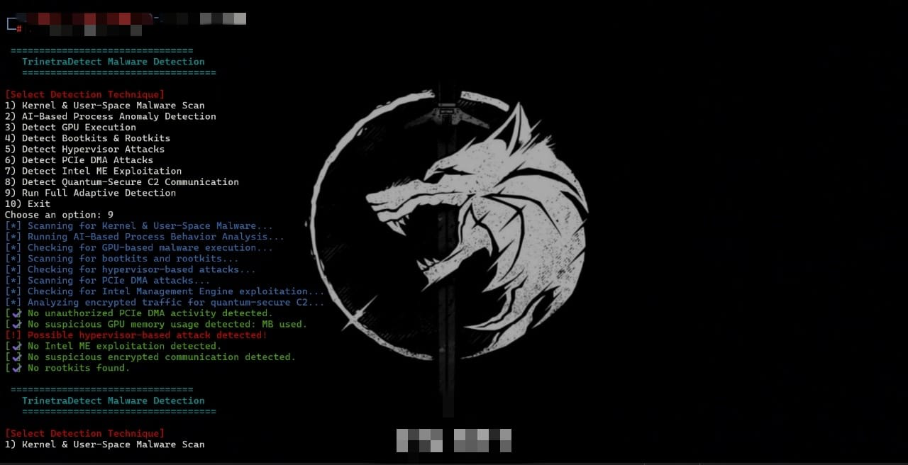

# 🔥 TrinetraDetect - Adaptive Malware Detection System  

TrinetraDetect is a **cross-platform malware detection framework** designed to detect **advanced threats** like:  
✅ **Kernel & User-Space Malware**  
✅ **AI-Powered Anomaly Detection**  
✅ **GPU Execution Malware Scan**  
✅ **PCIe DMA & Hypervisor Rootkits**  
✅ **Quantum-Secure C2 Traffic Analysis**  
✅ **Intel ME Exploitation Detection**  
✅ **Encryption + Obfuscation for Maximum Security**  

## 🚀 Features  
✔ **Multi-Platform Support**: Works on **Linux & Windows**  
✔ **AES-256 Encrypted Execution** (Password Protected)  
✔ **Auto-Delete on Failed Attempts**  
✔ **Steganography & C2 Analysis**  
✔ **Lightweight & Fast**  

## 🔧 Installation  
**Step 1:** Clone the repository  
```bash
git clone https://github.com/YOUR_GITHUB_USERNAME/TrinetraDetect.git  
cd TrinetraDetect
pip3 install -r requirements.txt
python3 TrinetraDetect.py
## Additional Added The Bash Script
sudo ./TrinetraDetect 

